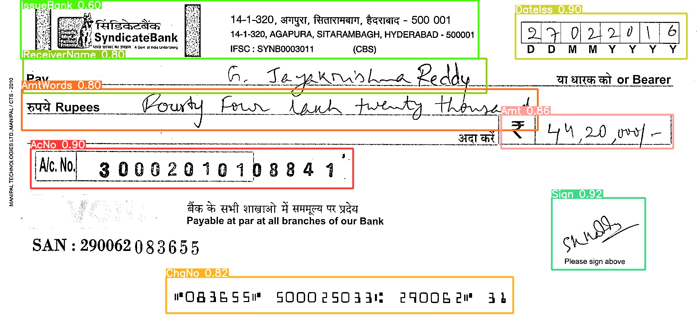
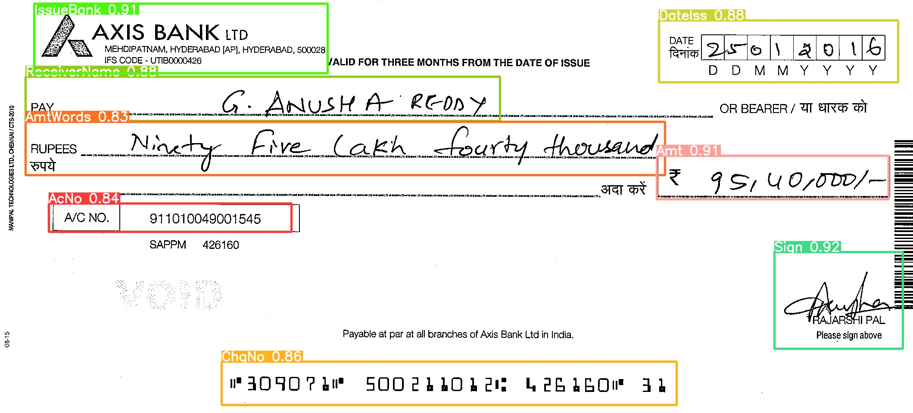

# Bank Cheque Field Extraction Using [YOLOv9](https://arxiv.org/abs/2402.13616)
Automated bank cheque field extraction module using YOLO9, an object detection AI model.

## Inference

``` shell

python detect.py --img 512 --conf-thres 0.1 --iou-thres 0.45 --max-det 1000 --device 0 --save-crop --weights runs/train/exp/weights/best.pt --source data/valid/images

```

<!-- You will get the results:

```
 Average Precision  (AP) @[ IoU=0.50:0.95 | area=   all | maxDets=100 ] = 0.530
 Average Precision  (AP) @[ IoU=0.50      | area=   all | maxDets=100 ] = 0.702
 Average Precision  (AP) @[ IoU=0.75      | area=   all | maxDets=100 ] = 0.578
 Average Precision  (AP) @[ IoU=0.50:0.95 | area= small | maxDets=100 ] = 0.362
 Average Precision  (AP) @[ IoU=0.50:0.95 | area=medium | maxDets=100 ] = 0.585
 Average Precision  (AP) @[ IoU=0.50:0.95 | area= large | maxDets=100 ] = 0.693
 Average Recall     (AR) @[ IoU=0.50:0.95 | area=   all | maxDets=  1 ] = 0.392
 Average Recall     (AR) @[ IoU=0.50:0.95 | area=   all | maxDets= 10 ] = 0.652
 Average Recall     (AR) @[ IoU=0.50:0.95 | area=   all | maxDets=100 ] = 0.702
 Average Recall     (AR) @[ IoU=0.50:0.95 | area= small | maxDets=100 ] = 0.541
 Average Recall     (AR) @[ IoU=0.50:0.95 | area=medium | maxDets=100 ] = 0.760
 Average Recall     (AR) @[ IoU=0.50:0.95 | area= large | maxDets=100 ] = 0.844
``` -->


## Training

<!-- Single GPU training

``` shell
# train yolov9 models
python train_dual.py --workers 8 --device 0 --batch 16 --data data/data.yaml --img 640 --cfg models/detect/yolov9-c.yaml --weights '' --name yolov9-c --hyp hyp.scratch-high.yaml --min-items 0 --epochs 500 --close-mosaic 15

# train gelan models
# python train.py --workers 8 --device 0 --batch 32 --data data/coco.yaml --img 640 --cfg models/detect/gelan-c.yaml --weights '' --name gelan-c --hyp hyp.scratch-high.yaml --min-items 0 --epochs 500 --close-mosaic 15
``` -->

Multiple GPU training

``` shell
# train yolov9 models
python train.py --batch 32 --epochs 1000 --img 512 --device 0 --min-items 0 --close-mosaic 10 --data data/data.yaml --cfg models/detect/gelan-c.yaml --hyp data/hyps/hyp.scratch-high.yaml --save-period 300 --patience 150
```

## Some Inference Results

**Sample 1:**



---

**Sample 2:**

